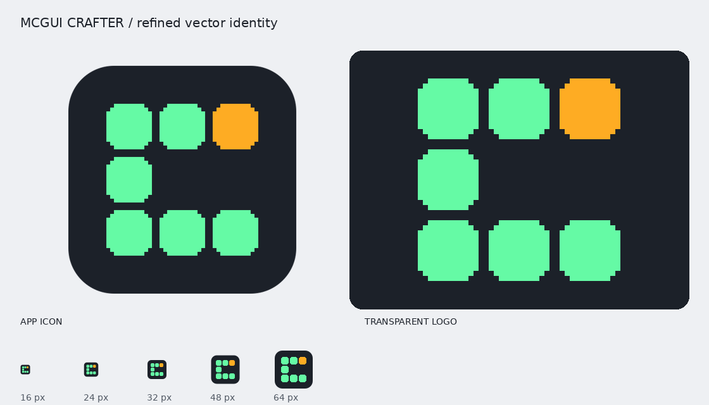

# MCGUI Crafter brand kit



## Production assets

[Download the refined brand kit](mcgui-crafter-brand-kit.zip). This is the version used by the application.

Editable source files live in [`assets/branding`](../../assets/branding/README.md):

- [Application icon](../../assets/branding/app-icon.svg): dark tile with transparent corners.
- [Transparent color mark](../../assets/branding/logo-mark.svg): for dark backgrounds.
- [Monochrome mark](../../assets/branding/logo-mono.svg): `currentColor` for inline SVG.
- [PNG icons, 16–1024 px](../../assets/branding/png/).

The mark is a C built from seven identical stepped cells. The top-right cell is amber. Keep the cells square, spacing equal, and the middle/right area empty. Do not stretch, rotate, add gradients, or change the selected cell. Use the tile on light surfaces, or a dark monochrome mark. Use an empty alt attribute beside the visible application name; use `alt="MCGUI Crafter"` when the logo alone identifies the application.

| Color | Hex | Role |
| --- | --- | --- |
| Charcoal | `#1c2129` | Application tile |
| Mint | `#65faa5` | Six cells |
| Amber | `#feac23` | Top-right cell |

## Application integration

The toolbar and start panel import the canonical SVG through Vite. The browser favicon uses the same SVG. Tauri uses `src-tauri/icons/icon.png` (512 px); regenerate it from the canonical SVG when updating the identity.

```sh
rsvg-convert -w 512 -h 512 assets/branding/app-icon.svg -o src-tauri/icons/icon.png
```

## Vectorize source archive

[Original Vectorize brand kit](vectorize-original-brand-kit.zip) preserves the service-generated exports, mockups, and usage material from revision `0033870f14a140b3a0d0690e6edd6694`. It uses the raw trace, before geometric cleanup, and is retained for provenance. Use the refined production assets above for application and brand work.

The refined kit is packaged from `assets/branding/`, excluding the original trace and with this guide included as `GUIDE.md`.
